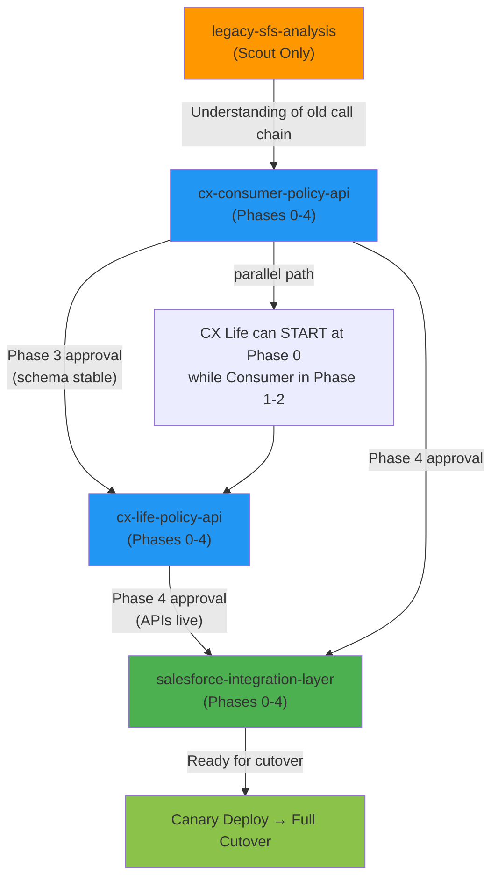

# Legacy Service Refactoring — Multi-Project Jump Start Scenario

**Scenario ID:** `refactor-legacy-services-2026`  
**Domain:** Enterprise Integration + API Refactoring  
**Complexity:** High (4 projects, 3-phase dependencies, brownfield analysis required)  
**Estimated Duration:** 8-12 weeks  
**Jump Start Phases Required:** Scout (brownfield) → All phases for 4 projects  

---

## Executive Summary

**Challenge:** Refactor a legacy call chain from monolithic Legacy Service Platform into a distributed, API-first microservices architecture.

**Current State (Legacy):**
```
Legacy Service Platform
    ↓
Query Service (brittle, slow)
    ↓
Transformation Service (unclear logic, poor error handling)
```

**Target State (New):**
```
Legacy Service Platform
    ↓
Facade API (GraphQL)
    ↓
Resource API (REST)
    ↓
Backend System APIs (canonical, reliable)
```

**Key Constraint:** Cannot cut over abruptly. Must run old + new in parallel, gradually migrate customer traffic, validate data consistency.

---

## 4-Project Structure

```
salesforce-refactor-2026/
│
├── projects/
│   ├── legacy-analysis/                   [Scout Phase Only]
│   │   └── Brownfield: Analyze existing "Query Service" → "Transformation Service" call chain
│   │
│   ├── facade-api/                        [Phases 0-4]
│   │   └── New GraphQL API layer for consumer queries
│   │   └── Depends on: legacy-analysis (understanding)
│   │
│   ├── resource-api/                      [Phases 0-4]
│   │   └── Refactored REST API for resource data
│   │   └── Depends on: facade-api (Phase 3 - stable contracts)
│   │
│   └── integration-layer/                 [Phases 0-4]
│       └── Adapter that routes requests to new APIs
│       └── Handles dual-write (old + new) during migration
│       └── Depends on: both facade-api and resource-api (Phase 4 - live)
│
└── .jumpstart/
    ├── projects.json           (4 projects, dependencies declared)
    ├── migration-runbook.md    (cutover strategy)
    └── state/
        └── workspace-state.json (tracks unblocking)
```

---

## Project Descriptions

### Project 1: Legacy Analysis (Scout Phase Only)

**Purpose:** Document the existing "Query Service" → "Transformation Service" call chain so teams understand what they're replacing.

**Type:** Brownfield (analyze only, do not change)

**Scope:**
- Reverse-engineer the current Legacy Service Platform integration
- Document data flows, error handling, performance characteristics
- Identify all consumers of the old API (for migration planning)
- Capture SLAs, rate limits, retry policies
- List all edge cases + workarounds in production

**Deliverable:** `specs/codebase-context.md` (Scout phase output)

**Phases:**
- Scout: ✅ Generate codebase context
- Stop (no Phase 0-4; this is analysis-only)

**Owner:** Platform/Integration Team

**Duration:** 2 weeks

---

### Project 2: Facade API (New Service)

**Purpose:** Build the new GraphQL API that replaces "Query Service" layer.

**Type:** Greenfield

**Scope:**
- Define GraphQL schema for consumer queries
- Implement resolvers for queries and mutations
- Integrate with Backend System services (read-only initially)
- Error handling + observability
- Authentication (OAuth2 via service account)
- Load testing to establish baseline performance

**Dependencies:**
- **Blocks:** Resource API (needs stable schema)
- **Blocked by:** Legacy Analysis (Phase Scout) must complete first

**Phases:**
- Phase 0: Challenger → Interrogate requirements (GraphQL vs REST trade-off)
- Phase 1: Analyst → User personas (consumer teams, backend teams)
- Phase 2: PM → API contract, stories, acceptance criteria
- Phase 3: Architect → Tech stack (Apollo Server, Node.js, PostgreSQL caching)
- Phase 4: Developer → Build, test, deploy to staging

**Owner:** API Platform Team

**Duration:** 4-5 weeks

---

### Project 3: Resource API (Refactored Service)

**Purpose:** Decouple resource data access from consumer API. Clean REST API with semantic versioning.

**Type:** Greenfield (built from scratch, NOT refactoring legacy service)

**Scope:**
- REST API (not GraphQL; simpler model, proven stability)
- Endpoints: `/resources/{resourceId}`, `/resources/{customerId}`, `/status`, etc.
- Caching layer (1hr TTL) to reduce backend load
- Circuit breaker to Backend System services
- Data validation + transformation
- Audit logging for compliance

**Dependencies:**
- **Blocks:** Integration Layer (needs this API live)
- **Blocked by:** Facade API Phase 3 (schema stability + learned lessons)

**Phases:**
- Phase 0: Challenger → Problem: "Backend System is slow, brittle, hard to integrate"
- Phase 1: Analyst → Personas (platform engineers, product teams using it)
- Phase 2: PM → REST API contract, SLAs, deprecation policy
- Phase 3: Architect → Stack (Express.js, PostgreSQL, Redis), integration points
- Phase 4: Developer → Build, test, deploy alongside Facade API

**Owner:** Backend Services Team

**Duration:** 4-5 weeks (overlaps with Facade API Phase 3-4)

---

### Project 4: Integration Layer (Adapter)

**Purpose:** Route requests to the new architecture while maintaining backward compatibility.

**Type:** Greenfield

**Scope:**
- Adapter that accepts old-style requests
- Translates to new API calls (Facade API → Resource API → Backend System)
- Dual-write during migration (old + new, compare results)
- Gradual traffic shifting (canary deployment)
- Rollback capability if new APIs have issues
- Feature flag to toggle between old and new paths

**Dependencies:**
- **Blocks:** Nothing (final step)
- **Blocked by:** Both APIs Phase 4 (must be live before integration layer can fully work)

**Phases:**
- Phase 0: Challenger → "Service traffic is currently monolithic; need controlled refactoring path"
- Phase 1: Analyst → Personas (service consumers, ops teams)
- Phase 2: PM → Integration contract, cutover strategy, rollback plan
- Phase 3: Architect → Dual-write pattern, feature flags, canary deployment approach
- Phase 4: Developer → Build adapter, run parallel validation, cutover script

**Owner:** Integration Team

**Duration:** 4-6 weeks (overlaps with API builds; starts after Phase 3)

---

## Dependency Graph



### Hard Dependencies

| Blocker | Blocked | Condition | Reason |
|---------|---------|-----------|--------|
| legacy-analysis (Scout) | facade-api (Phase 0) | Must complete first | Need understanding of old system to design new one |
| facade-api (Phase 3) | resource-api (Phase 0) | Can unblock when Phase 3 approved | Schema stability needed before design diverges |
| facade-api (Phase 4) | integration-layer (Phase 3) | Must be live | Integration layer routes TO this API |
| resource-api (Phase 4) | integration-layer (Phase 3) | Must be live | Integration layer routes TO this API |

### Soft Dependencies (Can Run in Parallel)

- Facade API & Resource API can both start Phase 0 (independent discovery)
- Facade API Phase 1-2 can run while Resource API Phase 0-1 runs (separate tracks)
- Integration Layer Phase 0-2 can run while both APIs Phase 3-4 (learning for later integration)

---

## Data Migration Strategy

### Phase 1: Shadow Reads (Weeks 5-6)

```
Service Request
    ↓
[New API] (shadow, logged)
[Old Path] (active, returned)
    ↓
Compare results → validation log
```

**Goal:** Identify data differences before traffic shift

**Success:** ≥99.5% shadow read consistency

---

### Phase 2: Canary Deployment (Weeks 7-8)

```
Service Request
    ↓
Feature Flag: 10% traffic → new, 90% → old
Monitor: error rates, latency, data accuracy
```

**Goal:** Prove new path works under production load

**Success:** New path error rate < old path, latency ±10%

---

### Phase 3: Gradual Migration (Weeks 9-10)

```
Traffic Shift:
  Week 9: 25% new, 75% old
  Week 10: 50% new, 50% old
Monitoring: All metrics green
```

---

### Phase 4: Full Cutover (Week 11)

```
100% traffic → new APIs
Old path decommissioned (Week 12, after validation)
```

---

## Risk Management

| Risk | Probability | Impact | Mitigation |
|------|------------|--------|-----------|
| New APIs don't match old behavior on edge cases | Medium | High | Shadow reads + comprehensive test suite (Phase 4) |
| Backend System doesn't scale under new traffic pattern | Medium | High | Load testing Phase 3; circuit breaker + cache (Phase 3-4) |
| Consumer teams not ready to integrate | High | Medium | Start Phase 0 interviews early (Week 1); build adapter first |
| Data consistency issues during migration | Medium | High | Dual-write validation (Phase 4 Integration Layer); audit logs |
| Ops team can't manage new distributed architecture | Low | High | Runbooks + on-call training (Phase 4); gradual cutover |

---

## Jump Start Framework Alignment

### Why This Scenario Tests Multi-Workspace

✅ **Scout Phase (Brownfield)** — Analyzes legacy code before any new work  
✅ **Multi-Project Coordination** — 4 projects with hard + soft dependencies  
✅ **Phased Dependencies** — Consumer Phase 3 unblocks Life Phase 0  
✅ **Cross-Project Architecture** — Each project must integrate with others  
✅ **Risk Management** — Migration strategy documented in PRD phase  
✅ **Observability** — Shadow reads, canary metrics, cutover signals  

### Configuration for projects.json

```json
{
  "workspace": {
    "id": "legacy-service-refactor",
    "enabled": true,
    "description": "Refactor legacy service call chain into distributed APIs"
  },
  "projects": [
    {
      "id": "proj-legacy-analysis",
      "name": "Legacy Analysis",
      "type": "brownfield",
      "status": "initializing",
      "phase": null,
      "approver": "PlatformLead",
      "blocked_by": [],
      "description": "Scout phase only — analyze existing Query Service → Transformation Service call chain"
    },
    {
      "id": "proj-facade-api",
      "name": "Facade API",
      "type": "greenfield",
      "status": "phase-0",
      "phase": 0,
      "approver": "APIOwner",
      "blocked_by": ["proj-legacy-analysis"],
      "description": "New GraphQL API for consumer queries"
    },
    {
      "id": "proj-resource-api",
      "name": "Resource API",
      "type": "greenfield",
      "status": "phase-0",
      "phase": null,
      "approver": "BackendOwner",
      "blocked_by": ["proj-facade-api:phase-3"],
      "description": "REST API for resource data, refactored from legacy"
    },
    {
      "id": "proj-integration-layer",
      "name": "Integration Layer",
      "type": "greenfield",
      "status": "phase-0",
      "phase": null,
      "approver": "IntegrationOwner",
      "blocked_by": ["proj-facade-api:phase-4", "proj-resource-api:phase-4"],
      "description": "Adapter routing requests to new APIs with dual-write validation"
    }
  ],
  "active_project": "proj-legacy-analysis",
  "settings": {
    "enforce_sequential_phases": true,
    "allow_parallel_projects": true,
    "pit_crew_review_required": true
  }
}
```

---

## Week-by-Week Roadmap

| Week | proj-legacy-analysis | proj-facade-api | proj-resource-api | proj-integration-layer |
|------|---------|---------|---------|---------|
| 1-2 | Scout: Analyze old system | Phase 0: Challenger | (Blocked) | (Blocked) |
| 3 | Done | Phase 1: Analyst | Phase 0: Challenger | (Blocked) |
| 4 | — | Phase 2: PM | Phase 1: Analyst | Phase 0: Challenger |
| 5 | — | Phase 3: Architect | Phase 2: PM | Phase 1: Analyst |
| 6 | — | Phase 4: Developer (build) | Phase 3: Architect | Phase 2: PM |
| 7 | — | **Phase 4: APPROVED** (staging) | Phase 4: Developer (build) | Phase 3: Architect |
| 8 | — | Shadow reads validation | **Phase 4: APPROVED** (staging) | Phase 4: Developer (build) |
| 9-10 | — | Canary deployment | Production validation | Integration + testing |
| 11 | — | Full cutover | — | Cutover + validation |

---

## Validation Checkpoints

### End of Scout Phase (Week 2)
- [ ] Codebase context document complete (Query Service, Transformation Service call chain documented)
- [ ] All callers identified (who depends on this API?)
- [ ] Performance baseline captured (latency, error rates)
- [ ] All workarounds and edge cases documented

### End of Facade API Phase 3 (Week 6)
- [ ] GraphQL schema approved
- [ ] All API contracts signed off
- [ ] Resource API can now start Phase 0 (unblocked)

### End of Facade API Phase 4 (Week 7)
- [ ] API live in staging
- [ ] Shadow reads + load tests passing
- [ ] Integration layer can now start Phase 3 (unblocked)

### End of Resource API Phase 4 (Week 8)
- [ ] REST API live in staging
- [ ] Data consistency validated against old system
- [ ] Integration layer can proceed to Phase 4

### End of Integration Layer Phase 4 (Week 10)
- [ ] Adapter tested in staging
- [ ] Canary deployment script ready
- [ ] Rollback procedures documented and tested
- [ ] Ready for cutover

### Post-Cutover Validation (Weeks 11-12)
- [ ] 100% traffic on new APIs, zero errors
- [ ] Old path successfully decommissioned
- [ ] Ops team trained + confident
- [ ] Customer impact zero

---

## Success Criteria

| Criterion | Measure | Target |
|-----------|---------|--------|
| **Refactoring Completeness** | All SfS traffic routed through new APIs | 100% by Week 11 |
| **Data Accuracy** | Shadow read consistency | ≥99.5% |
| **Performance** | New API latency vs old | ±10% (acceptable) |
| **Reliability** | New API error rate | < old path rate |
| **Migration Safety** | Rollback tests passed | 100% pass |
| **Team Confidence** | Ops team sign-off on cutover | Yes |
| **Cost Efficiency** | Backend load reduction | ≥20% via caching |

---

## Using This Scenario in Jump Start

### Setup Command
```bash
npx jumpstart-mode workspace create-project --id=proj-legacy-analysis --name="Legacy Analysis" --type=brownfield --approver=PlatformLead
npx jumpstart-mode workspace create-project --id=proj-facade-api --name="Facade API" --type=greenfield --approver=APIOwner
npx jumpstart-mode workspace create-project --id=proj-resource-api --name="Resource API" --type=greenfield --approver=BackendOwner
npx jumpstart-mode workspace create-project --id=proj-integration-layer --name="Integration Layer" --type=greenfield --approver=IntegrationOwner
```

### Start Scout Phase
```bash
npx jumpstart-mode workspace set-active proj-legacy-analysis
/jumpstart.scout
```

### Check Project Status
```bash
npx jumpstart-mode workspace status
```

### Validate Dependencies
```bash
npx jumpstart-mode workspace validate-deps
# Output: proj-cx-consumer-api blocked until scout complete, etc.
```

---

## Why This Tests Jump Start

✅ **Multi-Project Coordination** — Verifies workspace CLI, projects.json, dependencies  
✅ **Phase Gates** — Tests when projects unblock as upstream completes  
✅ **Brownfield Analysis** — Scout phase output feeds downstream phases  
✅ **Complex Dependencies** — Soft + hard blocks; parallel tracks allowed  
✅ **Risk Management** — Migration runbook (PRD), cutover strategy (Architecture)  
✅ **Cross-Project Awareness** — Pit Crew can discuss impacts across projects  

---

**Status:** Scenario Ready for Deployment  
**Last Updated:** 2026-06-03  
**Next Step:** Run `workspace create-project` commands to initialize all 4 projects, then start Scout phase
