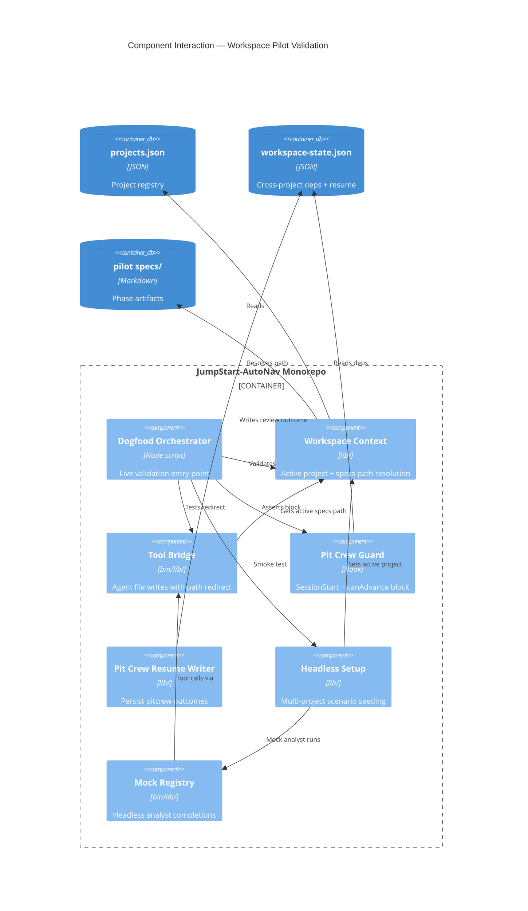
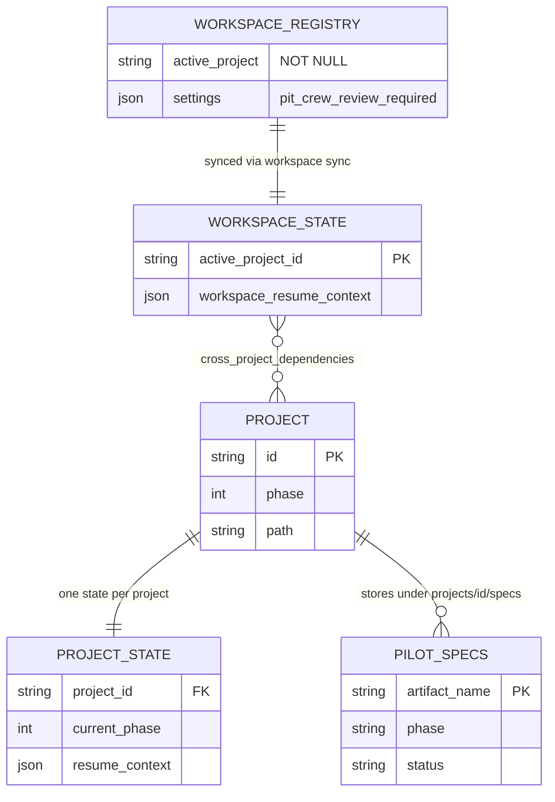

# Architecture Document — Workspace Pilot

> **Phase:** 3 — Solutioning  
> **Agent:** The Architect  
> **Status:** Approved  
> **Created:** 2026-06-08  
> **Approval date:** 2026-06-08  
> **Approved by:** Eric  
> **Upstream References:**
> - [challenger-brief.md](challenger-brief.md)
> - [product-brief.md](product-brief.md)
> - [prd.md](prd.md)

---

## Boundaries

### Always Do

- Write all pilot phase artifacts under `projects/proj-workspace-pilot/specs/`
- Run `npm run dogfood:workspace` after validation changes
- Use workspace-aware APIs (`getWorkspaceContext`, `loadSpec`, `WorkspaceManager`) — never hard-code root `specs/`
- Extend existing `lib/` modules before adding parallel implementations
- Follow library-first: new helpers in `lib/` with unit tests, wired from scripts/CLI/hooks

### Ask First

- Changing `.jumpstart/projects.json` dependency graph or unblock conditions
- Modifying Pit Crew gate behavior (`pit_crew_review_required`)
- Increasing headless `--max-turns` in dogfood (currently 3 for setup-only check)
- Adding new workspace P3 features (out of pilot scope per PRD)

### Never Do

- Pollute workspace root `specs/` with pilot artifacts
- Auto-unblock `proj-default` dependency without human Pit Crew approval
- Commit secrets or credentials in pilot specs
- Replace live LLM headless runs with mock-only CI without documenting the gap

---

## Technical Overview

The Workspace Pilot is a **validation program**, not a deployable application. Architecture describes how Jump Start multi-project workspace features (P0–P2) are exercised on a live nested project (`proj-workspace-pilot`) inside the AutoNav monorepo. The system under validation comprises registry/state sync, spec path scoping, Pit Crew cross-project gates, tool-bridge redirection, and headless multi-workspace setup.

Milestones M1–M2 (Must Have epics E1–E3-S1) are **already implemented** on `main`. Phase 3 architecture covers the remaining **Should Have** work: Pit Crew outcome capture in workspace resume context (E3-S2) and headless mock analyst completion for the multi-workspace scenario (E4-S1). No new runtime services, databases, or deployment targets are introduced.

---

## Existing System Context

**Source:** Framework ADRs ADR-009 through ADR-012; live code in `lib/workspace-*.js`, `scripts/dogfood-workspace-pilot.mjs`

### Current Architecture Summary

Jump Start operates in **multi-project mode** when `.jumpstart/projects.json` exists. The active project determines where phase artifacts load and write. `WorkspaceManager` coordinates registry ↔ per-project `state.json` sync. `workspace-pitcrew-guard` SessionStart hook injects Pit Crew guidance when blocked cross-project dependencies involve the active project. Headless runner copies fixture registries via `setupMultiWorkspaceScenario()` and routes artifacts to nested `projects/<id>/specs/`.

### Constraints from Existing System

| Constraint | Rationale | Impact on New Design |
|------------|-----------|---------------------|
| Inherited Node.js monorepo | Jump Start framework is CommonJS + ESM hybrid | New modules use `lib/*.js` CJS exports; tests use Vitest ESM |
| Sequential phase enforcement | `enforce_sequential_phases: true` on pilot | Pit Crew block on `proj-default` Phase 3 is expected, not a bug |
| Pit Crew gate enabled | `pit_crew_review_required: true` in registry | E3-S2 documents outcomes; does not bypass gate |
| Dogfood as MVP acceptance | Product brief + PRD | All changes must keep `npm run dogfood:workspace` green |
| Mock headless turn limit | Dogfood uses `--max-turns 3` | E4-S1 extends mock registry, not dogfood turn budget |

### Migration Strategy

No migration. Validation extends existing modules (`mock-responses.js`, new `workspace-pitcrew-resume.js`) and updates JSON state files. Backward compatibility with single-project mode is preserved — all new code paths guard on `context.workspace`.

---

## Technology Stack

| Layer | Choice | Version | Justification | Alternatives Considered |
|-------|--------|---------|---------------|------------------------|
| **Language** | JavaScript (Node.js) | >=14 [Context7: node@20] | Inherited from Jump Start framework | TypeScript — rejected; brownfield CJS codebase |
| **Runtime** | Node.js | >=14.0.0 (engines) | Matches `package.json` engines | Bun/Deno — no framework support |
| **Config parsing** | yaml | ^2.8.1 [Context7: yaml@2] | Pilot project config is YAML | JSON config — rejected; breaks Jump Start convention |
| **Testing** | Vitest | ^3.2.4 [Context7: vitest@3] | Existing test suite (~105 workspace tests) | Jest — not used in repo |
| **CLI IO** | stdin/stdout JSON | — | Article II CLI-first; dogfood + workspace CLI | Interactive prompts — breaks automation |
| **State storage** | JSON files | — | `projects.json`, `workspace-state.json`, per-project `state.json` | Database — overkill for validation |
| **CI/CD** | GitHub Actions + npm scripts | — | `npm test`, `npm run dogfood:workspace` | — |
| **Hosting** | N/A (validation only) | — | No deployment per PRD out-of-scope | — |

---

## System Components

### Component: Dogfood Orchestrator

| Attribute | Detail |
|-----------|--------|
| **Responsibility** | Single-command live validation of pilot layout, Pit Crew block, path redirection, sync audit, and headless setup smoke test |
| **Depends On** | Workspace Context, Tool Bridge, Pit Crew Guard, Headless Runner |
| **Exposes** | Exit code 0 + `"Dogfood pass complete"` on stdout |
| **Key Stories** | E2-S1, E3-S1 (verification) |
| **Key Files** | `scripts/dogfood-workspace-pilot.mjs` |

### Component: Workspace Context Layer

| Attribute | Detail |
|-----------|--------|
| **Responsibility** | Resolve active project, specs path, and multi-project vs single-project mode |
| **Depends On** | `projects.json`, per-project config YAML |
| **Exposes** | `getWorkspaceContext(rootDir)`, `loadSpec(context, filename)` |
| **Key Stories** | E1-S1, E1-S2 |
| **Key Files** | `lib/workspace-context.js`, `lib/spec-loader.js`, `lib/workspace-manager.js` |

### Component: Spec Path Redirection

| Attribute | Detail |
|-----------|--------|
| **Responsibility** | Redirect agent `create_file`/`write_file` targeting root `specs/` to active project nested specs |
| **Depends On** | Workspace Context Layer |
| **Exposes** | `{ redirected: true, path }` in tool-bridge responses |
| **Key Stories** | E2-S2 |
| **Key Files** | `lib/workspace-path-resolver.js`, `bin/lib/tool-bridge.js` |

### Component: Pit Crew Guard

| Attribute | Detail |
|-----------|--------|
| **Responsibility** | Detect blocked cross-project deps involving active project; inject SessionStart guidance; block phase advance via `canAdvanceProject` |
| **Depends On** | `workspace-state.json` dependencies, `workspace-parallel.js` |
| **Exposes** | `buildPitCrewBlock(root)`, hook JSON with `additionalContext` |
| **Key Stories** | E3-S1, E3-S2 |
| **Key Files** | `.github/hooks/workspace-pitcrew-guard.js`, `lib/workspace-parallel.js` |

### Component: Pit Crew Resume Writer (NEW)

| Attribute | Detail |
|-----------|--------|
| **Responsibility** | Persist Pit Crew session outcomes into `workspace_resume_context` after `/jumpstart.pitcrew` completes |
| **Depends On** | Pit Crew Guard, workspace state file |
| **Exposes** | `recordPitCrewReview(rootDir, { topic, outcome, nextSteps })` |
| **Key Stories** | E3-S2 |
| **Key Files** | `lib/workspace-pitcrew-resume.js` (new), `.jumpstart/state/workspace-state.json` |

### Component: Headless Multi-Project Setup

| Attribute | Detail |
|-----------|--------|
| **Responsibility** | Seed headless run directory with multi-project registry, nested projects, and phase artifacts into active project specs |
| **Depends On** | Fixture at `tests/fixtures/workspace/multi-project/` |
| **Exposes** | `setupMultiWorkspaceScenario()`, `copyPhaseArtifacts()`, `getWorkspacePromptSuffix()` |
| **Key Stories** | E4-S1 |
| **Key Files** | `lib/headless-workspace.js`, `bin/headless-runner.js` |

### Component: Mock Response Registry

| Attribute | Detail |
|-----------|--------|
| **Responsibility** | Canned `ask_questions` answers and optional completion responses for headless mock runs |
| **Depends On** | Headless runner LLM provider |
| **Exposes** | `createPersonaRegistry()`, `createMultiWorkspaceAnalystRegistry()` (new) |
| **Key Stories** | E4-S1 |
| **Key Files** | `bin/lib/mock-responses.js` |

---

## Component Interaction Diagram



---

## Data Model

Validation state is file-based JSON and markdown — no SQL database.

### Entity: WorkspaceRegistry

**Description:** Master list of projects in multi-project mode  
**Location:** `.jumpstart/projects.json`

| Field | Type | Constraints | Description |
|-------|------|-------------|-------------|
| `active_project` | string | NOT NULL | Currently selected project ID |
| `projects[]` | array | NOT NULL | Project entries with `id`, `phase`, `status`, `path` |
| `settings.pit_crew_review_required` | boolean | default true | Enables Pit Crew gate |

### Entity: WorkspaceState

**Description:** Runtime workspace metadata including cross-project dependencies  
**Location:** `.jumpstart/state/workspace-state.json`

| Field | Type | Constraints | Description |
|-------|------|-------------|-------------|
| `active_project_id` | string | NOT NULL | Mirrors registry active project |
| `workspace_resume_context.tldr` | string | | Human-readable workspace summary |
| `workspace_resume_context.cross_project_dependencies[]` | array | | `{ from, to, type, blocked, unblock_condition }` |
| `workspace_resume_context.last_pit_crew_review` | ISO8601 \| null | | Timestamp of last Pit Crew session |
| `workspace_resume_context.pit_crew_outcomes[]` | array | NEW | `{ date, topic, outcome, next_steps, dependency_ref }` |

### Entity: ProjectState

**Description:** Per-project phase progression  
**Location:** `projects/proj-workspace-pilot/.jumpstart/state/state.json`

| Field | Type | Constraints | Description |
|-------|------|-------------|-------------|
| `current_phase` | number | 0–4 | Last completed or active phase |
| `approved_artifacts[]` | array | | Gate-approved spec files |
| `resume_context` | object | | Agent session handoff blob |

### Entity Relationship Diagram



---

## API Contracts

CLI-first interfaces (Article II). No HTTP endpoints.

### `recordPitCrewReview(rootDir, payload)`

| Attribute | Detail |
|-----------|--------|
| **Description** | Append Pit Crew session outcome to workspace resume context |
| **Auth** | N/A (local file write) |
| **Story Reference** | E3-S2 |

**Request (function args):**

```javascript
{
  topic: "proj-workspace-pilot → proj-default Phase 3 dependency",
  outcome: "Acknowledged block; pilot continues Phase 3–4 independently",
  nextSteps: "Run proj-default /jumpstart.architect on separate track",
  dependencyRef: { from: "proj-workspace-pilot", to: "proj-default" }
}
```

**Response (success):**

```javascript
{ success: true, path: ".jumpstart/state/workspace-state.json", last_pit_crew_review: "2026-06-08T..." }
```

**Response (error):**

| Code | When |
|------|------|
| `WORKSPACE_STATE_MISSING` | `workspace-state.json` not found |
| `INVALID_PAYLOAD` | Missing `topic` or `outcome` |

### `createMultiWorkspaceAnalystRegistry()`

| Attribute | Detail |
|-----------|--------|
| **Description** | Mock registry with analyst-specific completions for multi-workspace scenario |
| **Story Reference** | E4-S1 |

**Returns:** Mock registry object with `getCompletionResponse()` that emits tool calls to write `product-brief.md` under active project specs within turn budget.

### `npm run dogfood:workspace`

| Attribute | Detail |
|-----------|--------|
| **Description** | End-to-end pilot validation script |
| **Story Reference** | E2-S1, NFR-P01, NFR-A01 |

**Success:** exit 0, stdout contains `Dogfood pass complete`  
**Failure:** exit 1, failing step name printed

---

## Infrastructure and Deployment

### Deployment Strategy

No deployment. Validation runs locally and in CI via Vitest + optional dogfood script.

### Environment Strategy

| Environment | Purpose | Notes |
|-------------|---------|-------|
| Local dev | Dogfood + unit tests | Repo root as cwd |
| CI | Vitest workspace + dogfood tests | Sparse checkout may skip live pilot tests |

### CI/CD Pipeline

```
Push to main
  -> npm test (vitest run)
  -> test-dogfood-workspace-pilot.test.js (registry phase check)
  -> Optional: npm run dogfood:workspace in full checkout jobs
```

### Environment Variables

| Variable | Description | Required | Secret? |
|----------|-------------|----------|---------|
| None for pilot validation | — | — | — |

Live headless runs may use `OPENAI_API_KEY` — out of pilot MVP scope (mock only).

### Scaling Considerations

Not applicable. Dogfood NFR-P01 target: < 30 seconds on dev machine.

---

## Architecture Decision Records

| ADR | Title | Status | File |
|-----|-------|--------|------|
| ADR-001 | Pit Crew resume context capture | Accepted | [decisions/001-pitcrew-resume-capture.md](decisions/001-pitcrew-resume-capture.md) |
| ADR-002 | Headless mock analyst extension | Accepted | [decisions/002-headless-mock-extension.md](decisions/002-headless-mock-extension.md) |

Framework ADRs ADR-009–012 govern underlying workspace infrastructure and are referenced, not duplicated.

---

## Project Structure

```
JumpStart-AutoNav/                          # Workspace root
├── .jumpstart/
│   ├── projects.json                       # Registry (active: proj-workspace-pilot)
│   └── state/workspace-state.json          # Cross-project deps + pit crew outcomes
├── lib/
│   ├── workspace-context.js                # Mode + active project resolution
│   ├── workspace-manager.js                # Sync, canAdvanceProject
│   ├── workspace-parallel.js               # Pit Crew gate logic
│   ├── workspace-path-resolver.js          # Spec write redirection
│   ├── headless-workspace.js               # Multi-project headless setup
│   └── workspace-pitcrew-resume.js         # NEW — E3-S2 outcome writer
├── bin/
│   ├── headless-runner.js                  # Agent emulation CLI
│   ├── workspace.js                        # Workspace management CLI
│   └── lib/
│       ├── tool-bridge.js                  # Agent tool execution
│       └── mock-responses.js               # Mock registry (extend for E4-S1)
├── scripts/
│   └── dogfood-workspace-pilot.mjs         # Live validation orchestrator
├── tests/
│   ├── test-dogfood-workspace-pilot.test.js
│   ├── test-headless-workspace.test.js
│   ├── test-workspace-pitcrew-resume.test.js  # NEW
│   └── e2e/scenarios/multi-workspace/    # Headless scenario manifest
└── projects/
    └── proj-workspace-pilot/
        ├── .jumpstart/config.yaml
        ├── .jumpstart/state/state.json
        └── specs/                          # Pilot phase artifacts (this document)
```

---

## Commands

| Command | Purpose | Expected Output |
|---------|---------|-----------------|
| `npm run dogfood:workspace` | Full pilot validation | Exit 0, `Dogfood pass complete` |
| `npm test` | All Vitest tests | Exit 0 |
| `npx vitest run tests/test-workspace-*.test.js tests/test-dogfood-workspace-pilot.test.js` | Workspace test subset | Exit 0 |
| `node bin/workspace.js sync --audit` | Registry/state drift check | Exit 0, zero errors |
| `node bin/workspace.js status` | Show active project and phases | Lists proj-workspace-pilot at phase N |
| `node bin/headless-runner.js --agent analyst --scenario multi-workspace --mock --max-turns 8` | E4-S1 completion test | Creates product-brief in scenario tmp specs |
| `node bin/headless-runner.js --agent analyst --scenario multi-workspace --mock --max-turns 3` | Dogfood smoke (setup only) | Log includes `Multi-project workspace` |

---

## Testing

| Attribute | Value |
|-----------|-------|
| **Framework** | Vitest ^3.2.4 |
| **Unit tests** | `tests/test-workspace-*.test.js`, `tests/test-headless-workspace.test.js` |
| **Integration** | `tests/test-dogfood-workspace-pilot.test.js` (live repo paths) |
| **E2E scenario** | `tests/e2e/scenarios/multi-workspace/` |
| **Coverage expectation** | New `lib/` modules require dedicated test file; dogfood must stay green |
| **Run** | `npm test` or targeted `npx vitest run <file>` |

Prior art for test patterns: `tests/test-headless-workspace.test.js` (tmp dir setup), `tests/test-workspace-path-resolver.test.js` (path redirect).

---

## Code Style

- CommonJS (`module.exports`) in `lib/` and `bin/`; ESM allowed in `scripts/*.mjs` and Vitest tests
- Function names: `camelCase`; files: `kebab-case.js` or `workspace-feature.js`
- JSON state writes: `JSON.stringify(obj, null, 2)` for readable diffs
- No wrapper abstractions around Node `fs` — use direct calls per Article VII
- JSDoc `@param` on new public library functions

Example canonical pattern for new library module:

```javascript
'use strict';
const fs = require('fs');
const path = require('path');

/**
 * @param {string} rootDir
 * @param {{ topic: string, outcome: string, nextSteps?: string }} payload
 */
function recordPitCrewReview(rootDir, payload) {
  if (!payload?.topic || !payload?.outcome) {
    throw new Error('INVALID_PAYLOAD: topic and outcome required');
  }
  // read → mutate workspace_resume_context → write
}

module.exports = { recordPitCrewReview };
```

---

## Git Workflow

- Branch: work on `main` for pilot validation (small incremental commits)
- Commit prefix: `feat(workspace-pilot):`, `test(workspace-pilot):`, `docs(workspace-pilot):`
- Phase gate commits: include artifact approval in message (e.g., `feat(workspace-pilot): approve Phase 3 architecture`)
- PR optional for solo maintainer; push to `origin/main` after approval
- Run `npm run dogfood:workspace` before phase gate commits

---

## Security Architecture

### Trust Boundaries

```
[IDE Agent] --> [Tool Bridge] --> [File System: pilot specs/]
                     ^
              Path resolver enforces active project scope
[SessionStart Hook] --> [Read-only: workspace-state.json]
```

### Data Protection

| Data Asset | Sensitivity | Protection |
|-----------|-------------|------------|
| Pilot specs | Low | No credentials; manual review per NFR |
| workspace-state.json | Low | Local JSON; no PII |

Pilot validation has no authentication surface. Pit Crew outcomes are operator-authored text — sanitize length (max 4KB per outcome) to prevent state bloat.

---

## Insights Reference

**Companion Document:** [specs/insights/architecture-insights.md](insights/architecture-insights.md)

1. **Validation not application** — Architecture documents test infrastructure, not deployable services.
2. **Pit Crew block is feature** — E3-S2 captures decisions; does not remove gate.
3. **Mock vs live headless** — Dogfood stays setup-only; E4-S1 proven in dedicated test with higher turn budget.

---

## Documentation Freshness

See [documentation-audit.md](documentation-audit.md). Freshness score: **100%** (3/3 technologies verified from repo + official docs).

---

## Six Core Areas Coverage (Article XII)

- [x] **Commands**: Documented above with full flags
- [x] **Testing**: Framework, locations, expectations documented
- [x] **Project Structure**: Directory layout with annotations
- [x] **Code Style**: Conventions + canonical snippet
- [x] **Git Workflow**: Branch, commit, gate protocol
- [x] **Boundaries**: Three-tier constraints at document top

---

## Phase Gate Approval

- [x] Human has reviewed this Architecture Document
- [x] Every technology choice has a stated justification
- [x] Component responsibilities are clearly defined
- [x] Data model covers all entities implied by PRD stories
- [x] API contracts cover all interfaces implied by PRD stories
- [x] ADRs exist for all significant technical decisions
- [x] Project structure is defined
- [x] Environment variables are documented
- [x] Human has explicitly approved this document for Phase 4 handoff

**Approved by:** Eric  
**Approval date:** 2026-06-08  
**Status:** Approved

---

## Linked Data

```json-ld
{
  "@context": { "js": "https://jumpstart.dev/schema/" },
  "@type": "js:SpecArtifact",
  "@id": "js:architecture-workspace-pilot",
  "js:phase": 3,
  "js:agent": "Architect",
  "js:status": "Approved",
  "js:version": "1.0.0",
  "js:upstream": [
    { "@id": "js:prd-workspace-pilot" },
    { "@id": "js:product-brief-workspace-pilot" },
    { "@id": "js:challenger-brief-workspace-pilot" }
  ],
  "js:downstream": [
    { "@id": "js:implementation-plan-workspace-pilot" }
  ]
}
```
