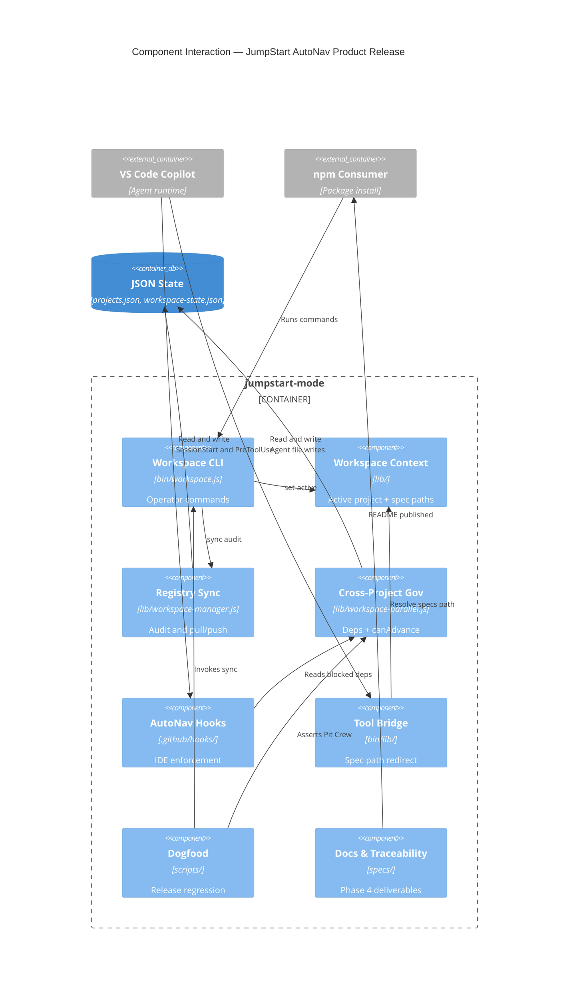
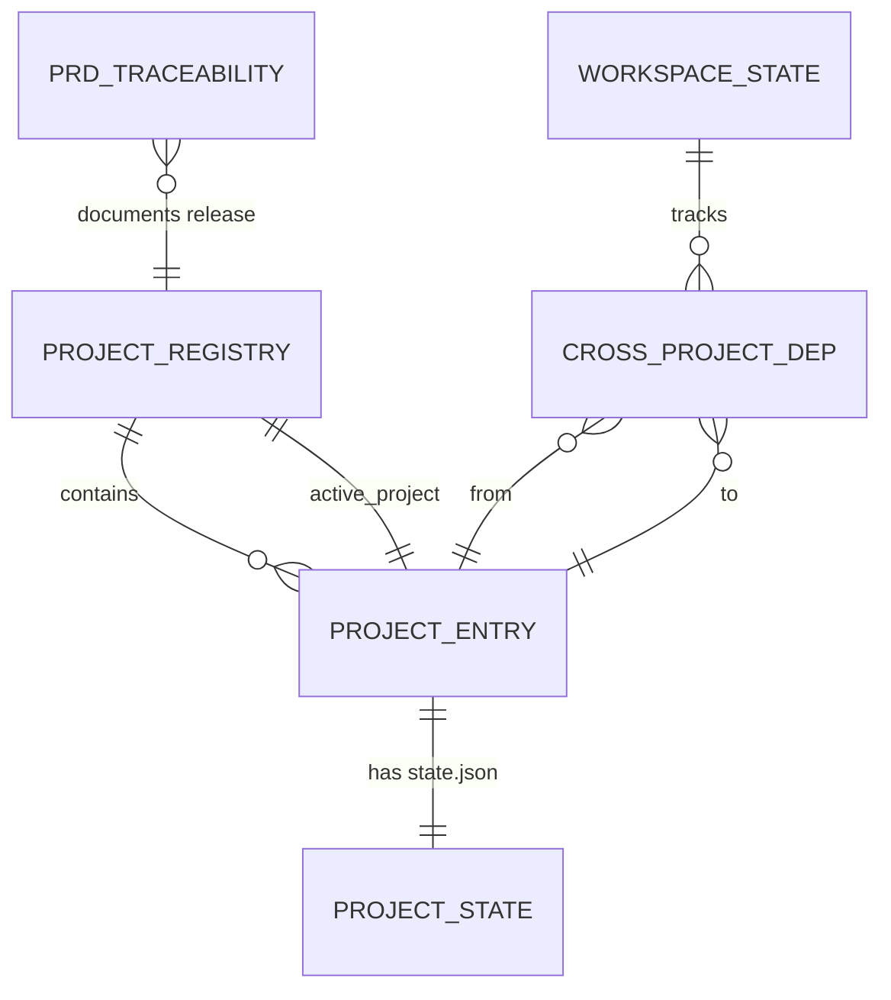

# Architecture Document — JumpStart AutoNav

> **Phase:** 3 — Solutioning  
> **Agent:** The Architect  
> **Status:** Approved  
> **Created:** 2026-06-08  
> **Approval date:** 2026-06-08  
> **Approved by:** Eric  
> **Upstream References:**
> - [challenger-brief.md](challenger-brief.md)
> - [product-brief.md](product-brief.md)
> - [prd.md](prd.md)
> - [codebase-context.md](codebase-context.md)

---

## Boundaries

### Always Do

- Treat root `specs/` as source of truth when `proj-default` is active (Article IV)
- Extend existing `lib/`, `bin/`, `.github/hooks/` — library-first per Article I
- Run `node bin/workspace.js sync --audit` after each root phase gate
- Keep `npm run dogfood:workspace` green before npm publish
- Map every Phase 4 change to a PRD story in `specs/prd-traceability.md`
- Reference framework ADRs ADR-009–012 for workspace infrastructure decisions

### Ask First

- Adding workspace P3 features deferred in ADR-012 (allocate-budget, graph queries)
- Changing Pit Crew unblock conditions in `workspace-state.json`
- Major semver bump or breaking CLI/hook contract changes
- Modifying `proj-workspace-pilot` specs (nested project stays isolated)

### Never Do

- Greenfield rewrite of workspace stack (brownfield constraint)
- Auto-unblock cross-project dependencies without human gate approval
- Pollute pilot specs from root Phase 4 work
- Ship npm release without completed Must Have traceability matrix

---

## Technical Overview

JumpStart AutoNav is a **spec-driven agentic framework** distributed as the npm package `jumpstart-mode`. The workspace-first product release documents and gates multi-project coordination (registry, sync, Pit Crew, hooks, headless) already implemented under ADR-009–012 and validated by `proj-workspace-pilot`. Architecture is a **brownfield extension**: no new runtime services or databases; Phase 4 delivers documentation alignment, PRD traceability, hook tier catalog, and minor semver publish per ADR-013/014.

The system is a Node.js CLI + IDE hook layer operating on JSON state files (`projects.json`, `workspace-state.json`, per-project `state.json`) and YAML config. Operators interact via `jumpstart-mode workspace *` commands, VS Code Copilot `/jumpstart.*` agents, and automation via `npm run dogfood:workspace`. Phase 3 approval satisfies PRD E1-S3 and triggers evaluation of the pilot → root cross-project unblock condition.

---

## Existing System Context (Brownfield Only)

**Source:** [codebase-context.md](codebase-context.md)

### Current Architecture Summary

AutoNav comprises five subsystems: (1) phase agents producing gated `specs/` artifacts, (2) multi-project workspace with `getWorkspaceContext()` and `WorkspaceManager`, (3) 26 AutoNav VS Code hooks, (4) headless runner with mock/live LLM modes, (5) CLIs (`jumpstart-mode`, `workspace`, `headless-runner`). C4 context diagram in codebase-context shows Operator → IDE → AutoNav → LLM.

### Constraints from Existing System

| Constraint | Rationale | Impact on New Design |
|------------|-----------|---------------------|
| CommonJS + ESM hybrid | Brownfield repo | New helpers in `lib/*.js`; Vitest ESM tests |
| ADR-009–012 accepted | Workspace P0–P2 shipped | Architecture references, does not redesign |
| `proj-workspace-pilot` complete | Validation done | Dogfood script targets pilot; root specs separate |
| Sequential phases enforced | Registry setting | Phase 3 gate is intentional unblock trigger |
| npm `files` whitelist | package.json | Docs must live in published paths (README, `.jumpstart/`) |
| Pit Crew required | `pit_crew_review_required: true` | Document outcomes; do not bypass |

### Migration Strategy

**No code migration.** Single-project repos opt into workspace via `jumpstart-mode workspace upgrade`, preserving root specs as `proj-default`. Product release adds documentation and traceability only (ADR-013). Backward compatibility verified by existing migration tests under `tests/test-workspace-migration*.test.js`.

---

## Technology Stack

| Layer | Choice | Version | Justification | Alternatives Considered |
|-------|--------|---------|---------------|------------------------|
| **Language** | JavaScript | ES2020+ | Brownfield codebase | TypeScript — rejected for scope |
| **Runtime** | Node.js | >=14.0.0 `[Context7: node@20]` | package.json engines; CI Node 20 | Bun/Deno — unsupported |
| **Framework** | Jump Start AutoNav | 1.1.13 | Product itself | N/A |
| **Config** | yaml | ^2.8.1 `[Context7: yaml@2]` | `.jumpstart/config.yaml` | JSON — breaks convention |
| **State** | JSON files | — | Registry, workspace, project state | DB — overkill |
| **Testing** | Vitest | ^3.2.4 `[Context7: vitest@3]` | 100+ tests incl. workspace | Jest — not used |
| **CLI IO** | stdout/stderr + exit codes | — | Article II CLI-first | Interactive-only — breaks CI |
| **IDE Integration** | VS Code Copilot hooks | autonav.json | Deterministic governance | Prompt-only — no gates |
| **CI/CD** | GitHub Actions | quality.yml | Batched vitest on main | — |
| **Hosting** | npm registry | — | CLI/npm product per PRD | SaaS — out of scope |

---

## System Components

### Component: Workspace CLI

| Attribute | Detail |
|-----------|--------|
| **Responsibility** | Operator commands: upgrade, status, set-active, sync, validate-deps, report, pitcrew-record, create-project |
| **Depends On** | WorkspaceManager, workspace-migration, workspace-pitcrew-resume |
| **Exposes** | `jumpstart-mode workspace <command>` via `bin/workspace.js` |
| **Key Stories** | E2-S1 through E2-S4, E3-S2 |
| **Key Files** | `bin/workspace.js`, `lib/workspace-manager.js`, `lib/workspace-migration.js` |

### Component: Workspace Context & Spec Loader

| Attribute | Detail |
|-----------|--------|
| **Responsibility** | Resolve active project, specs path, upstream artifact loading for agents |
| **Depends On** | `projects.json`, per-project config YAML |
| **Exposes** | `getWorkspaceContext()`, `loadSpec()`, `loadUpstreamArtifact()` |
| **Key Stories** | E2-S2, E1-S1 |
| **Key Files** | `lib/workspace-context.js`, `lib/spec-loader.js` |

### Component: Registry Sync Engine

| Attribute | Detail |
|-----------|--------|
| **Responsibility** | Bidirectional sync between `projects.json` and per-project `state.json`; drift audit |
| **Depends On** | WorkspaceManager |
| **Exposes** | `sync --audit`, `sync --pull`, `sync --push` |
| **Key Stories** | E2-S3 |
| **Key Files** | `lib/workspace-manager.js` |

### Component: Cross-Project Governance

| Attribute | Detail |
|-----------|--------|
| **Responsibility** | Blocked dependency tracking, Pit Crew gate, phase advancement checks |
| **Depends On** | `workspace-state.json`, workspace-parallel |
| **Exposes** | `canAdvanceProject()`, `validate-deps`, Pit Crew SessionStart injection |
| **Key Stories** | E2-S4, E3-S1, E3-S3 |
| **Key Files** | `lib/workspace-parallel.js`, `.github/hooks/workspace-pitcrew-guard.js` |

### Component: Pit Crew Resume Writer

| Attribute | Detail |
|-----------|--------|
| **Responsibility** | Persist Pit Crew outcomes to workspace resume context |
| **Depends On** | workspace-state.json |
| **Exposes** | `recordPitCrewReview()`, `workspace pitcrew-record` CLI |
| **Key Stories** | E3-S2 |
| **Key Files** | `lib/workspace-pitcrew-resume.js` |

### Component: Spec Path Redirection

| Attribute | Detail |
|-----------|--------|
| **Responsibility** | Redirect agent file writes from root `specs/` to active nested project specs |
| **Depends On** | Workspace Context |
| **Exposes** | Redirect metadata in tool-bridge responses |
| **Key Stories** | E2-S2 (verification via dogfood) |
| **Key Files** | `lib/workspace-path-resolver.js`, `bin/lib/tool-bridge.js` |

### Component: AutoNav Hooks Layer

| Attribute | Detail |
|-----------|--------|
| **Responsibility** | IDE lifecycle enforcement: phase gates, schema validation, drift detection, workspace context |
| **Depends On** | Hook scripts in `.github/hooks/` |
| **Exposes** | SessionStart / PreToolUse / PostToolUse JSON responses |
| **Key Stories** | E3-S1, E6-S1 |
| **Key Files** | `.github/hooks/autonav.json`, Must Have hooks per ADR-015 |

### Component: Release Regression (Dogfood)

| Attribute | Detail |
|-----------|--------|
| **Responsibility** | Single-command validation of workspace behavior on live pilot project |
| **Depends On** | All workspace components above |
| **Exposes** | `npm run dogfood:workspace`, `npm run dogfood:workspace:headless` |
| **Key Stories** | E5-S1, E5-S2, E6-S2 |
| **Key Files** | `scripts/dogfood-workspace-pilot.mjs`, `tests/test-dogfood-workspace-pilot.test.js` |

### Component: Product Documentation & Traceability (Phase 4)

| Attribute | Detail |
|-----------|--------|
| **Responsibility** | README/MULTI_WORKSPACE alignment; PRD-to-test traceability matrix |
| **Depends On** | Approved PRD, this architecture |
| **Exposes** | `specs/prd-traceability.md`, updated README sections |
| **Key Stories** | E4-S1, E4-S2, E4-S3, E5-S3, E6-S1, E6-S2 |
| **Key Files** | `README.md`, `.jumpstart/MULTI_WORKSPACE.md`, `specs/prd-traceability.md` (new) |

---

## Component Interaction Diagram



---

## Data Model

Workspace product release persists state as **JSON documents** (no SQL). Phase 4 adds a markdown traceability artifact.

### Entity: ProjectRegistry (`projects.json`)

**Description:** Workspace-level registry of all Jump Start projects.

| Field | Type | Constraints | Description |
|-------|------|-------------|-------------|
| `workspace.id` | string | NOT NULL | Workspace identifier |
| `workspace.enabled` | boolean | NOT NULL | Multi-project mode on/off |
| `projects[]` | array | NOT NULL | Registered projects |
| `projects[].id` | string | PK within workspace | e.g., `proj-default` |
| `projects[].path` | string | NOT NULL | Relative path (`.` or `projects/...`) |
| `projects[].phase` | number | nullable | Current approved phase |
| `projects[].status` | string | NOT NULL | e.g., `phase-2` |
| `active_project` | string | FK → projects[].id | Active project pointer |
| `settings.enforce_sequential_phases` | boolean | NOT NULL | Phase ordering |
| `settings.pit_crew_review_required` | boolean | NOT NULL | Pit Crew gate |

### Entity: WorkspaceState (`workspace-state.json`)

**Description:** Cross-project dependencies, Pit Crew outcomes, resume context.

| Field | Type | Constraints | Description |
|-------|------|-------------|-------------|
| `active_project_id` | string | NOT NULL | Denormalized active id |
| `workspace_resume_context.cross_project_dependencies[]` | array | — | Blocked deps graph |
| `workspace_resume_context.pit_crew_outcomes[]` | array | — | Recorded reviews |
| `last_updated` | ISO-8601 | NOT NULL | Audit timestamp |

**Dependency edge:**

| Field | Type | Description |
|-------|------|-------------|
| `from` | string | Source project id |
| `to` | string | Target project id |
| `blocked` | boolean | Gate active |
| `unblock_condition` | string | e.g., `Phase 3` |

### Entity: ProjectState (`.jumpstart/state/state.json` per project)

**Description:** Phase progression and approved artifacts for one project.

| Field | Type | Description |
|-------|------|-------------|
| `current_phase` | number | Latest approved phase |
| `approved_artifacts[]` | array | Gate-approved spec files |
| `resume_context` | object | Session handoff blob |

### Entity: PRDTraceability (`specs/prd-traceability.md`) — Phase 4

**Description:** Matrix linking PRD Must Have stories → README → tests/scripts.

| Column | Description |
|--------|-------------|
| Story ID | e.g., E2-S1 |
| README ref | Section anchor or path |
| Test/script ref | Vitest file or npm script |
| Status | COMPLETE / GAP |

### Entity Relationship Diagram



---

## API Contracts

AutoNav product surface is **CLI-first** (Article II), not HTTP REST.

### Workspace CLI Contract

#### `jumpstart-mode workspace upgrade`

| Attribute | Detail |
|-----------|--------|
| **Description** | Migrate single-project layout to multi-project registry |
| **Auth** | Local filesystem |
| **Story Reference** | E2-S1 |

**Success:** exit code `0`; creates `.jumpstart/projects.json`  
**Error:** exit code `1`; stderr message if already migrated or invalid layout

---

#### `jumpstart-mode workspace status`

| Attribute | Detail |
|-----------|--------|
| **Description** | List projects with phase, status, locks |
| **Story Reference** | E2-S1 |

**Success:** exit code `0`; human-readable table on stdout

---

#### `jumpstart-mode workspace set-active <project-id>`

| Attribute | Detail |
|-----------|--------|
| **Description** | Set active project for spec scoping and hooks |
| **Story Reference** | E2-S2 |

**Success:** exit code `0`; updates `active_project` in registry  
**Error:** exit code `1`; unknown project id

---

#### `jumpstart-mode workspace sync --audit`

| Attribute | Detail |
|-----------|--------|
| **Description** | Detect drift between registry and project state files |
| **Story Reference** | E2-S3 |

**Success:** exit code `0`; stdout contains `No drift detected`  
**Error:** exit code non-zero; lists drift items

---

#### `jumpstart-mode workspace validate-deps`

| Attribute | Detail |
|-----------|--------|
| **Description** | Report blocked cross-project dependencies |
| **Story Reference** | E2-S4 |

**Success:** exit code `0`; lists dependencies including `unblock_condition`

---

#### `jumpstart-mode workspace report --format json`

| Attribute | Detail |
|-----------|--------|
| **Description** | Machine-readable workspace report |
| **Story Reference** | E2-S4 |

**Response (Success):**

```json
{
  "active_project_id": "proj-default",
  "cross_project_dependencies": [
    {
      "from": "proj-workspace-pilot",
      "to": "proj-default",
      "blocked": true,
      "unblock_condition": "Phase 3"
    }
  ]
}
```

---

#### `node bin/workspace.js pitcrew-record --topic=... --outcome=...`

| Attribute | Detail |
|-----------|--------|
| **Description** | Append Pit Crew outcome to workspace-state.json |
| **Story Reference** | E3-S2 |

**Error:** missing required flags → exit code `1`

---

### Hook Response Contract (SessionStart)

**Producer:** `workspace-pitcrew-guard.js`  
**Story Reference:** E3-S1

```json
{
  "additionalContext": "Pit Crew Review Required: ... /jumpstart.pitcrew"
}
```

Present when blocked dependency involves active project.

---

## Infrastructure and Deployment

### Deployment Strategy

Package published to **npm** as `jumpstart-mode`. Consumers install globally or per-project; no server deployment. IDE hooks ship in `.github/hooks/` within the package `files` list.

### Environment Strategy

| Environment | Purpose | Notes |
|-------------|---------|-------|
| Local dev | Framework maintainers | `npm test`, dogfood scripts |
| CI (GitHub Actions) | Regression gate | Batched vitest on push to main |
| npm registry | Adopters | `npm publish` after Phase 4 release tasks |

### CI/CD Pipeline

```
Push to main (specs/**, .jumpstart/**, tests/**)
  → npm ci
  → Layer 1–5 quality tests (schema, handoffs, spec-quality, regression)
  → Batched vitest (includes test-workspace-*.test.js)
```

Release gate adds: `npm run dogfood:workspace` before publish (maintainer local or CI job).

### Environment Variables

| Variable | Description | Required | Secret? |
|----------|-------------|----------|---------|
| `OPENAI_API_KEY` | Headless live LLM mode | No (mock default) | Yes |
| `LITELLM_*` | LiteLLM proxy config | No | Yes |

> Workspace CLI and dogfood mock path require **no** secrets.

### Scaling Considerations

CLI tool for local/CI use. NFR-T01 (≥10 projects) satisfied by JSON registry design; no horizontal scaling concerns for MVP.

---

## Architecture Decision Records

| ADR | Title | Status | File |
|-----|-------|--------|------|
| ADR-009 | Multi-Workspace Project Coordination | Accepted | [.jumpstart/decisions/ADR-009-multi-workspace.md](../.jumpstart/decisions/ADR-009-multi-workspace.md) |
| ADR-010 | Workspace Sync Mechanism | Accepted | [.jumpstart/decisions/ADR-010-workspace-sync.md](../.jumpstart/decisions/ADR-010-workspace-sync.md) |
| ADR-011 | Agent Multi-Project Integration | Accepted | [.jumpstart/decisions/ADR-011-agent-multiproject-integration.md](../.jumpstart/decisions/ADR-011-agent-multiproject-integration.md) |
| ADR-012 | Advanced Multi-Project Features (deferred) | Accepted | [.jumpstart/decisions/ADR-012-advanced-multiproject-features.md](../.jumpstart/decisions/ADR-012-advanced-multiproject-features.md) |
| ADR-013 | Documentation-First Phase 4 | Accepted | [specs/decisions/013-product-release-doc-first-phase4.md](decisions/013-product-release-doc-first-phase4.md) |
| ADR-014 | Minor Semver Workspace Release | Accepted | [specs/decisions/014-minor-semver-workspace-release.md](decisions/014-minor-semver-workspace-release.md) |
| ADR-015 | Must Have Hook Subset | Accepted | [specs/decisions/015-must-have-hook-subset.md](decisions/015-must-have-hook-subset.md) |

---

## Project Structure

```
JumpStart-AutoNav/
├── bin/                          # CLI: jumpstart-mode, workspace, headless-runner
├── lib/                          # Workspace, spec-loader, phase-gate, pitcrew-resume
├── .github/hooks/                # AutoNav IDE hooks (autonav.json)
├── .jumpstart/
│   ├── config.yaml               # proj-default config
│   ├── projects.json             # Workspace registry
│   ├── MULTI_WORKSPACE.md        # Deep-dive workspace docs (Phase 4 align)
│   ├── decisions/                # ADR-009–012 infrastructure ADRs
│   └── state/
│       ├── state.json            # proj-default state
│       └── workspace-state.json  # Cross-project deps
├── projects/proj-workspace-pilot/  # Nested validation project (isolated specs)
├── scripts/dogfood-workspace-pilot.mjs
├── specs/                        # proj-default product specs (THIS TRACK)
│   ├── prd.md
│   ├── architecture.md
│   ├── implementation-plan.md
│   ├── prd-traceability.md       # Phase 4 create
│   └── decisions/                # ADR-013–015 product ADRs
├── tests/                        # Vitest; test-workspace-*, dogfood tests
└── README.md                     # npm adopter entry (Phase 4 align)
```

---

## Commands

| Command | Purpose |
|---------|---------|
| `npm test` | Run full Vitest suite |
| `npm run dogfood:workspace` | Live workspace regression (~90s) |
| `npm run dogfood:workspace:headless` | Mock analyst multi-workspace path |
| `node bin/workspace.js sync --audit` | Registry drift check |
| `node bin/workspace.js set-active <id>` | Switch active project |
| `npx jumpstart-mode workspace status` | Published CLI entry (via bin) |

---

## Testing

| Area | Location | Run |
|------|----------|-----|
| Workspace unit/integration | `tests/test-workspace-*.test.js` | `npx vitest run tests/test-workspace-*.test.js` |
| Dogfood | `tests/test-dogfood-workspace-pilot.test.js` | `npm run dogfood:workspace` |
| CI | `.github/workflows/quality.yml` | Batched on push to main |

Coverage expectation: all PRD Must Have stories mapped to at least one test or script in `prd-traceability.md`.

---

## Code Style

- CommonJS in `lib/` and `bin/` (`require`/`module.exports`)
- Vitest tests use ESM `import` where configured
- Hook scripts: single-purpose files, JSON stdout for Copilot hook protocol
- CLI errors to `stderr`, success messages to `stdout`

Example library export:

```javascript
// lib/workspace-pitcrew-resume.js
function recordPitCrewReview(rootDir, { topic, outcome, nextSteps }) {
  // mutates workspace-state.json pit_crew_outcomes[]
}
module.exports = { recordPitCrewReview };
```

---

## Git Workflow

- Branch: `main` for product track; conventional commits (`feat(autonav):`, `fix(dogfood):`)
- Phase gate approvals: dedicated commits after Eric approves with gate checkboxes
- Run `workspace sync --audit` before phase approval commits
- Do not force-push `main`

---

## Security Architecture

### Trust Boundaries

```
npm install → local filesystem (project + .jumpstart/)
IDE Agent → hooks (read specs, advise/block tools) → lib/ (no network by default)
Headless live mode → LLM API (optional, env-gated secrets)
```

### Data Protection

| Data Asset | Sensitivity | At Rest | Access Control |
|-----------|-------------|---------|----------------|
| Spec artifacts | Medium | Plain files in repo | Git + IDE workspace |
| API keys | High | Env vars only | secrets-path-blocker hook |
| workspace-state.json | Low | JSON in repo | No PII |

### OWASP Top 10 Considerations

| Risk | Mitigation | Component |
|------|------------|-----------|
| A01 Broken Access Control | Phase boundary guard blocks wrong-phase tools | phase-boundary-guard.js |
| A02 Cryptographic Failures | No passwords stored; TLS for npm/LLM | — |
| A03 Injection | No SQL; YAML parse via trusted library | yaml package |

---

## Insights Reference

**Companion Document:** [specs/insights/architecture-insights.md](insights/architecture-insights.md)

1. **Brownfield doc-first** — Phase 4 is alignment, not rebuild  
2. **Hook filename mapping** — ADR-015 corrects PRD logical names  
3. **Phase 3 unblock** — Critical path for pilot dependency  

---

## Cross-Reference Links

| This Document | Links To | Section |
|---|---|---|
| Components | [prd.md](prd.md) | Epics E2–E6 |
| ADRs | [specs/decisions/](decisions/) | Product release decisions |
| Infra ADRs | [.jumpstart/decisions/](../.jumpstart/decisions/) | ADR-009–012 |
| Docs audit | [documentation-audit.md](documentation-audit.md) | Freshness score |
| Phase 4 tasks | [implementation-plan.md](implementation-plan.md) | Milestones M2–M4 |

---

## Six Core Areas Coverage (Article XII)

- [x] **Commands**: workspace CLI, dogfood, test commands documented above
- [x] **Testing**: Vitest locations and CI pipeline documented
- [x] **Project Structure**: Directory layout with annotations
- [x] **Code Style**: CJS/ESM conventions with example
- [x] **Git Workflow**: Branch, commits, sync audit documented
- [x] **Boundaries**: Always Do / Ask First / Never Do at document top

---

## Phase Gate Approval

- [x] Human has reviewed this Architecture Document
- [x] Every technology choice has a stated justification
- [x] Component responsibilities are clearly defined
- [x] Data model covers all entities implied by PRD stories
- [x] API contracts cover all endpoints implied by PRD stories
- [x] ADRs exist for all significant technical decisions
- [x] Project structure is defined
- [x] Environment variables are documented
- [x] Human has explicitly approved this document for Phase 4 handoff

**Approved by:** Eric  
**Approval date:** 2026-06-08  
**Status:** Approved

---

## Linked Data

```json-ld
{
  "@context": { "js": "https://jumpstart.dev/schema/" },
  "@type": "js:SpecArtifact",
  "@id": "js:architecture-autonav",
  "js:phase": 3,
  "js:agent": "Architect",
  "js:status": "Approved",
  "js:version": "1.0.0",
  "js:upstream": [
    { "@id": "js:prd-autonav" },
    { "@id": "js:product-brief-autonav" },
    { "@id": "js:challenger-brief-autonav" }
  ],
  "js:downstream": [
    { "@id": "js:implementation-plan-autonav" }
  ]
}
```
