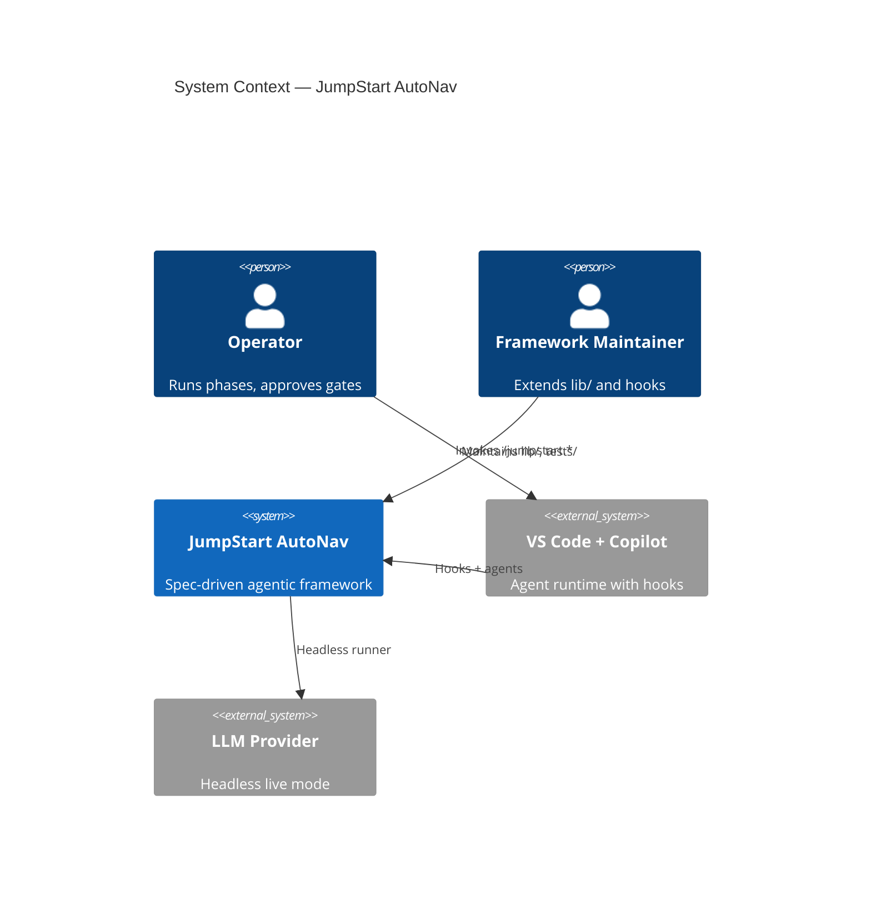

# Codebase Context — JumpStart AutoNav

> **Phase:** Pre-0 — Reconnaissance  
> **Agent:** The Scout  
> **Status:** Approved  
> **Created:** 2026-06-08  
> **Approval date:** 2026-06-08  
> **Approved by:** Eric  

---

## Project Overview

| Attribute | Detail |
|-----------|--------|
| **Project Name** | JumpStart AutoNav (`jumpstart-mode` npm package) |
| **Primary Language(s)** | JavaScript (CommonJS + ESM hybrid) |
| **Framework(s)** | Jump Start agentic workflow (custom) |
| **Build System** | npm scripts |
| **Package Manager** | npm |
| **Runtime** | Node.js >= 14 |
| **Repository Age** | Active development (2026) |
| **Approximate Size** | ~100+ lib/bin modules, 100+ test files |

---

## Repository Structure

```
JumpStart-AutoNav/
├── bin/                    # CLI: jumpstart-mode, headless-runner, workspace, holodeck
├── lib/                    # Workspace, spec-loader, phase-gate, hooks support
├── .github/hooks/          # 26 AutoNav lifecycle hooks (autonav.json)
├── .jumpstart/             # Framework config, agents, templates, ADRs, state
├── projects/
│   └── proj-workspace-pilot/   # Nested validation project (Phase 0–4 complete)
├── scripts/                # Dogfood and utility scripts
├── tests/                  # Vitest unit/integration/e2e
└── specs/                  # Root project specs (proj-default)
```

### Directory Purposes

| Directory | Purpose |
|-----------|---------|
| `lib/` | Core libraries: workspace context, sync, parallel mode, cost, ADR registry, knowledge graph |
| `bin/` | CLI entry points and headless agent emulation |
| `.github/hooks/` | Deterministic enforcement of roadmap principles in IDE sessions |
| `.jumpstart/` | Agent personas, templates, schemas, workspace registry |
| `projects/` | Nested Jump Start projects in multi-workspace mode |
| `tests/` | Vitest; workspace, hooks, headless, dogfood coverage |

---

## Technology Stack

| Category | Technology | Version | Role |
|----------|-----------|---------|------|
| Language | JavaScript | ES2020+ | Application + tests |
| Runtime | Node.js | >=14 | CLI and hooks |
| Testing | Vitest | ^3.2.4 | Unit/integration |
| Config | yaml | ^2.8.1 | Project config parse |
| LLM | LiteLLM proxy / OpenAI SDK | ^6.x | Headless live mode |

---

## Architecture Summary

Jump Start AutoNav is a **spec-driven agentic framework** — not a traditional web app. Core subsystems:

1. **Phase agents** (Challenger → Developer) producing `specs/` artifacts with human gates  
2. **Multi-project workspace** — `projects.json`, sync, Pit Crew cross-project governance  
3. **AutoNav hooks** — 26 VS Code Copilot hooks enforcing phase integrity, schema, drift detection  
4. **Headless runner** — mock/live agent emulation with workspace path scoping  
5. **CLI** — `jumpstart-mode`, `workspace` commands  



---

## Existing Patterns

- **Library-first:** Features in `lib/*.js`, wired from CLI/hooks  
- **CLI-first IO:** JSON stdout for automation (Article II)  
- **Workspace-aware specs:** `getWorkspaceContext()` + `loadSpec()` for nested projects  
- **Tests:** Vitest ESM tests with tmp dirs; `createRequire` for CJS lib imports  

---

## Technical Debt & Observations

| Area | Observation | Severity |
|------|-------------|----------|
| Root specs track | `proj-default` at Phase 0 — no product brief/PRD at repo root | High |
| Config at root | `.jumpstart/config.yaml` was empty until proj-default activation | Medium |
| Dual package paths | `bin/headless-runner.js` and `bin/lib/headless-runner.js` legacy | Low |
| Pilot dependency | Workspace pilot blocked until root Phase 3 | Informational |

---

## Phase Gate Approval

- [x] Human has reviewed this codebase context
- [x] Technology stack is accurately documented
- [x] Architecture summary reflects the existing system
- [x] Human has approved this document for Phase 0 handoff

**Approved by:** Eric  
**Approval date:** 2026-06-08  
**Status:** Approved
